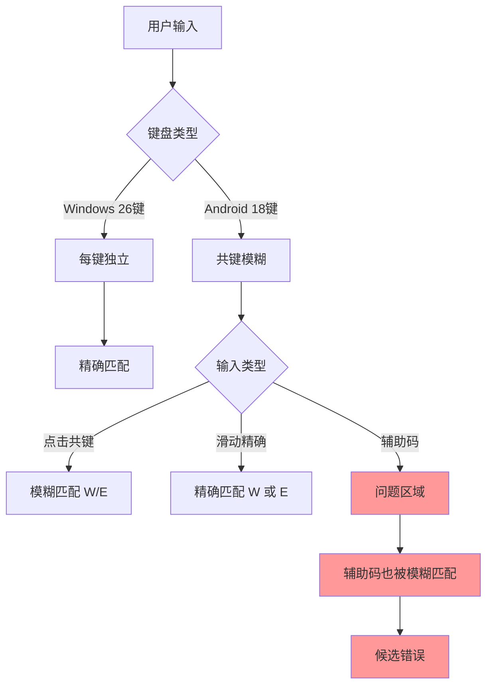
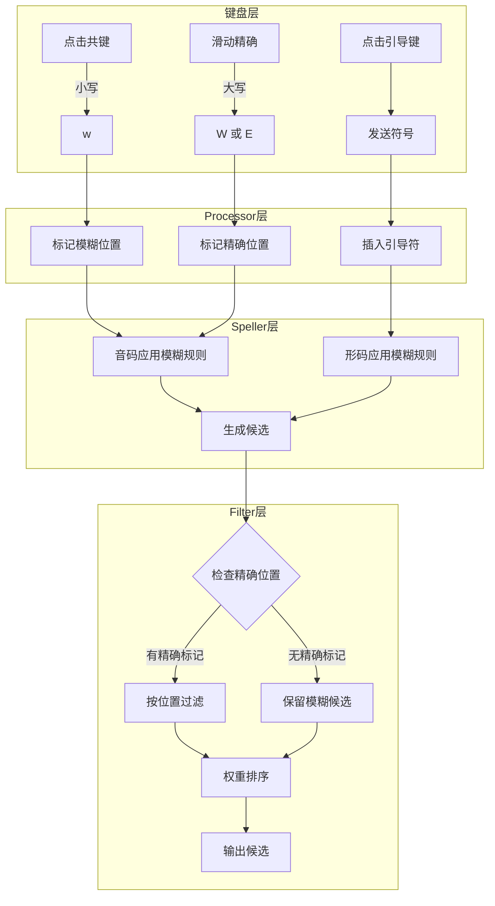

# moqi-xh-18key 输入方案设计文档

**版本**: v3.1
**更新日期**: 2026-01-05
**采用方案**: 形码引导键方案
**实施状态**: ✅ 已完成

---

## 目录

1. [问题分析](#问题分析)
2. [方案选型](#方案选型)
3. [18键键盘布局](#18键键盘布局)
4. [方案详细设计](#方案详细设计)
5. [实施计划](#实施计划)
6. [测试用例](#测试用例)

---

## 问题分析

### 当前问题

用户反馈 [`moqi_xh-trime.custom.yaml`](../moqi_xh-trime.custom.yaml) 存在以下体验问题：

1. **无法出现正确候选** - 模糊匹配过于宽泛，导致候选结果不准确
2. **辅助码和音码混输识别错误** - 辅助码 `[` 引导与18键模糊输入产生冲突
3. **从Windows 26键迁移不完整** - 原方案为 [`moqi_xh-weasel.custom.yaml`](../moqi_xh-weasel.custom.yaml)，适配Android 18键时缺乏系统性设计

### 根本原因



**核心问题**：当前的模糊规则 `derive` 应用于整个拼音字符串，包括辅助码部分。当用户想输入 `syff`（拼音`sy` + 辅助码`ff`）时，无法明确区分哪部分是拼音，哪部分是辅助码。

---

## 方案选型

### 评估的方案

| 方案 | 描述 | 输入效率 | 准确性 | 实现复杂度 |
|------|------|----------|--------|------------|
| **方案1：全智能** | 智能识别3码/4码，无需引导 | ⭐⭐⭐⭐⭐ | ⭐⭐⭐ | 高 |
| **方案2：形码引导键** ✅ | 点击引导键进入形码输入 | ⭐⭐⭐⭐ | ⭐⭐⭐⭐⭐ | 低 |

### 选择方案2的理由

1. **无歧义**：引导键明确标识形码开始，100%准确解析
2. **用户心智清晰**：点击引导键 = 我要输形码了
3. **实现简单可靠**：无需复杂的智能识别算法
4. **保留分词功能**：上滑引导键发送分词符 `'`
5. **形码也支持模糊**：减少用户滑动需求

### 方案2输入示例

| 目标 | 输入序列 | 按键次数 |
|------|----------|----------|
| 损 | `(SD)Y` → `sy` | 2次点击 |
| 损（带形码f） | `(SD)Y` `[` `(FG)` → `sy[f` | 3次点击 |
| 损（带形码ff） | `(SD)Y` `[` `(FG)(FG)` → `sy[ff` | 4次点击 |
| 损失 | `(SD)Y` `[` `(FG)` `(UI)` → `sy[fui` | 4次点击 |
| 损·失（分词） | `(SD)Y` `'↑` `(UI)` → `sy'ui` | 3次（含1次上滑） |

---

## 18键键盘布局

基于 [`shouxin_18key.trime.yaml`](../shouxin_18key.trime.yaml) 的布局：

```
第一行：Q(独立) | WE | RT | Y(独立) | U(独立) | IO | P(独立)
第二行：A(独立) | SD | FG | H(独立) | JK | L(独立)
第三行：Z(独立) | XC | V(独立) | BN | M(独立)
第四行：符号区 | [ 引导键 | 空格 | 退格等
```

### 共键对照表

| 共键 | 字母1 | 字母2 | 滑动行为 |
|------|-------|-------|----------|
| WE | W | E | 左滑W，右滑E |
| RT | R | T | 左滑R，右滑T |
| IO | I | O | 左滑I，右滑O |
| SD | S | D | 左滑S，右滑D |
| FG | F | G | 左滑F，右滑G |
| JK | J | K | 左滑J，右滑K |
| XC | X | C | 左滑X，右滑C |
| BN | B | N | 左滑B，右滑N |

### 形码引导键设计

```yaml
# 分词键改造为形码引导键
key_auxiliary:
  label: "[''"          # 显示：点击[，上滑'
  click: "["            # 点击：发送形码引导符
  swipe_up: "'"         # 上滑：发送分词符
  composing: "["        # 输入态也发送 [
```

---

## 方案详细设计

### 核心原则

1. **结构明确**：`[` 明确分隔音码和形码
2. **形码也模糊**：形码部分支持共键模糊，减少滑动
3. **按需精确**：只有候选不满意时才滑动精确输入

### 输入结构

```
完整输入格式：
  音码1 [ 形码1 音码2 [ 形码2 音码3 ...
  
其中：
  - 音码：固定2个字母（小鹤双拼）
  - 形码：1或2个字母（墨奇辅助码）
  - 形码匹配前一节音码
```

### 输入解析规则

```mermaid
flowchart TD
    A[用户输入] --> B{包含[?}
    B -->|否| C[纯音码模式]
    B -->|是| D[混合模式]
    
    C --> C1[按双拼分割]
    C1 --> C2[每2字符一个音节]
    
    D --> D1[按[分割]
    D1 --> D2{[后有字符?}
    D2 -->|是| D3[解析为形码]
    D2 -->|否| D4[等待输入]
    
    D3 --> D5{后续长度}
    D5 -->|1或2字符| D6[作为形码]
    D5 -->|3+字符| D7[1-2为形码,其余为下一音码]
```

### 解析示例

| 用户输入 | 解析结果 | 说明 |
|----------|----------|------|
| `sy` | 音码:[sy] | 纯双拼 |
| `sy[f` | 音码:[sy] 形码:[f] | 一位形码 |
| `sy[ff` | 音码:[sy] 形码:[ff] | 两位形码 |
| `sy[fui` | 音码:[sy] 形码:[f] 音码:[ui] | 形码后继续音码 |
| `sy[ffui` | 音码:[sy] 形码:[ff] 音码:[ui] | 两位形码+音码 |
| `sy[fui[g` | 音码:[sy,ui] 形码:[f,g] | 多字带形码 |

### 架构图



### Speller规则设计

#### 音码模糊规则

只对双拼部分应用共键模糊：

```yaml
speller:
  algebra:
    # === 辅助码处理规则（保持原有） ===
    - derive|^(.+)[[](\w)(\w)$|$1|          # 纯双拼
    - derive|^(.+)[[](\w)(\w)$|$1$2|        # 双拼+一位辅助码（无[）
    - derive|^(.+)[[](\w)(\w)$|$1[$2|       # 双拼+[+一位辅助码
    - derive|^(.+)[[](\w)(\w)$|$1$2$3|      # 双拼+2位辅助码（无[）
    - derive|^(.+)[[](\w)(\w)$|$1[$2$3|     # 双拼+[+2位辅助码
    - derive|^(.+)[[](\w)(\w)$|$1$2$3o|     # 整句单字 syffo
    - derive|^(.+)[[](\w)(\w)$|$1$2$3/|     # 整句单字 syff/
    
    # === 飞键规则 ===
    - derive/^([y])j/$1f/
    - derive/^qx/qw/
    - derive/^xq/xo/
    - derive/^qq/qo/
    - derive/^ww/wi/
    - derive/^j([a-twyz])/f$1/
    - derive/^([y])h/$1g/
    - derive/^([rsgv])c/$1n/
    
    # === 18键共键模糊（音码部分） ===
    # 声母位置模糊（第1位）
    - derive/^w([a-z])/e$1/
    - derive/^e([a-z])/w$1/
    - derive/^r([a-z])/t$1/
    - derive/^t([a-z])/r$1/
    - derive/^s([a-z])/d$1/
    - derive/^d([a-z])/s$1/
    - derive/^f([a-z])/g$1/
    - derive/^g([a-z])/f$1/
    - derive/^j([a-z])/k$1/
    - derive/^k([a-z])/j$1/
    - derive/^x([a-z])/c$1/
    - derive/^c([a-z])/x$1/
    - derive/^b([a-z])/n$1/
    - derive/^n([a-z])/b$1/
    - derive/^i([a-z])/o$1/
    - derive/^o([a-z])/i$1/
    
    # 韵母位置模糊（第2位）
    - derive/^([a-z])w$/$1e/
    - derive/^([a-z])e$/$1w/
    - derive/^([a-z])r$/$1t/
    - derive/^([a-z])t$/$1r/
    - derive/^([a-z])s$/$1d/
    - derive/^([a-z])d$/$1s/
    - derive/^([a-z])f$/$1g/
    - derive/^([a-z])g$/$1f/
    - derive/^([a-z])j$/$1k/
    - derive/^([a-z])k$/$1j/
    - derive/^([a-z])x$/$1c/
    - derive/^([a-z])c$/$1x/
    - derive/^([a-z])b$/$1n/
    - derive/^([a-z])n$/$1b/
    - derive/^([a-z])i$/$1o/
    - derive/^([a-z])o$/$1i/
```

#### 形码模糊规则

形码部分（`[`之后）也需要支持共键模糊：

```yaml
    # === 18键共键模糊（形码部分） ===
    # 形码第1位模糊
    - derive/\[w/[e/
    - derive/\[e/[w/
    - derive/\[r/[t/
    - derive/\[t/[r/
    - derive/\[s/[d/
    - derive/\[d/[s/
    - derive/\[f/[g/
    - derive/\[g/[f/
    - derive/\[j/[k/
    - derive/\[k/[j/
    - derive/\[x/[c/
    - derive/\[c/[x/
    - derive/\[b/[n/
    - derive/\[n/[b/
    - derive/\[i/[o/
    - derive/\[o/[i/
    
    # 形码第2位模糊
    - derive/\[(\w)w/[$1e/
    - derive/\[(\w)e/[$1w/
    - derive/\[(\w)r/[$1t/
    - derive/\[(\w)t/[$1r/
    # ... 其他共键对
```

### Lua Processor 设计

#### precise_input_processor.lua 更新

```lua
-- 精确输入处理器
-- 功能：记录滑动精确位置，转换大写为小写

local precise_positions = {}  -- 存储精确位置

local function processor(key_event, env)
    local context = env.engine.context
    local key = key_event.keycode
    local char = utf8.char(key)
    
    -- 检测大写字母（滑动精确输入）
    if char:match("^[A-Z]$") then
        local pos = #context.input + 1
        precise_positions[pos] = char:lower()
        
        -- 转换为小写后继续处理
        context:push_input(char:lower())
        return 1  -- kAccepted
    end
    
    -- 检测引导键
    if char == "[" then
        context:push_input("[")
        return 1
    end
    
    -- 其他按键正常处理
    return 2  -- kNoop
end

return { func = processor, precise_positions = precise_positions }
```

### Lua Filter 设计

#### precise_input_filter.lua 更新

```lua
-- 精确输入过滤器
-- 功能：根据精确位置过滤不匹配的候选

local processor = require("precise_input_processor")

local function filter(input, env)
    local context = env.engine.context
    local user_input = context.input
    local precise_pos = processor.precise_positions
    
    -- 如果没有精确位置标记，直接输出所有候选
    if next(precise_pos) == nil then
        for cand in input:iter() do
            yield(cand)
        end
        return
    end
    
    -- 解析用户输入
    local parsed = parse_input(user_input)
    
    for cand in input:iter() do
        local match = true
        
        -- 检查每个精确位置
        for pos, expected_char in pairs(precise_pos) do
            local actual = get_char_at_position(cand, parsed, pos)
            if actual ~= expected_char then
                match = false
                break
            end
        end
        
        if match then
            yield(cand)
        end
    end
end

-- 解析输入为结构化数据
local function parse_input(input)
    local result = { segments = {} }
    local current_segment = { pinyin = "", auxiliary = "" }
    local in_auxiliary = false
    
    for i = 1, #input do
        local c = input:sub(i, i)
        if c == "[" then
            in_auxiliary = true
        elseif c == "'" then
            -- 分词符，开始新segment
            table.insert(result.segments, current_segment)
            current_segment = { pinyin = "", auxiliary = "" }
            in_auxiliary = false
        elseif in_auxiliary then
            current_segment.auxiliary = current_segment.auxiliary .. c
            -- 形码最多2位后自动回到拼音模式
            if #current_segment.auxiliary >= 2 then
                table.insert(result.segments, current_segment)
                current_segment = { pinyin = "", auxiliary = "" }
                in_auxiliary = false
            end
        else
            current_segment.pinyin = current_segment.pinyin .. c
            -- 拼音满2位后，如果不是[则开始新segment
            if #current_segment.pinyin >= 2 then
                -- 等待看下一个字符
            end
        end
    end
    
    if #current_segment.pinyin > 0 or #current_segment.auxiliary > 0 then
        table.insert(result.segments, current_segment)
    end
    
    return result
end

return filter
```

### 键盘布局更新

#### shouxin_18key.trime.yaml 修改

```yaml
# 形码引导键（替代原分词键）
key_auxiliary:
  width: 10
  key_text_size: 18
  label: "['"
  hint: "形码/分词"
  click: "["
  long_click: "'"
  swipe_up: "'"
  swipe_down: "]"
  composing: "["
  has_menu: "["
```

---

## 实施计划

### 第一阶段：基础框架 ✅

- [x] 1.1 创建 `moqi_xh-18key.schema.yaml` - 继承moqi.yaml的基础schema
- [x] 1.2 创建 `moqi_xh-18key.custom.yaml` - 18键专用patch
- [x] 1.3 配置新的speller模糊规则（音码+形码）

### 第二阶段：Lua处理器 ✅

- [x] 2.1 更新 `precise_input_processor.lua` - 处理精确输入标记和形码引导键
- [x] 2.2 更新 `precise_input_filter.lua` - 实现结构化解析和过滤
- [x] 2.3 添加输入解析逻辑（识别音码/形码边界）

### 第三阶段：键盘适配 ✅

- [x] 3.1 更新 `shouxin_18key.trime.yaml` - 添加形码引导键
- [x] 3.2 确认滑动精确输入配置正确
- [x] 3.3 优化键盘布局和视觉提示

### 第四阶段：测试验证 🔄

- [ ] 4.1 测试纯音码输入
- [ ] 4.2 测试形码引导输入
- [ ] 4.3 测试精确/模糊混合输入
- [ ] 4.4 测试多字连续输入
- [ ] 4.5 修复发现的问题

---

## 测试用例

### 基础测试

| 测试场景 | 输入 | 预期候选 | 验证点 |
|----------|------|----------|--------|
| 纯音码点击 | `(SD)Y` | 孙/损/笋/... | 共键模糊生效 |
| 纯音码滑动 | `滑S滑Y` | 仅"sy"拼音字 | 精确匹配 |
| 形码1位 | `(SD)Y[F` | 损(ff)/孙(fs)/... | 形码f/g模糊 |
| 形码2位 | `(SD)Y[(FG)(FG)` | 形码ff/fg/gf/gg匹配 | 形码模糊 |
| 形码精确 | `(SD)Y[滑F滑F` | 仅形码ff匹配 | 形码精确 |

### 连续输入测试

| 测试场景 | 输入 | 预期候选 | 验证点 |
|----------|------|----------|--------|
| 双字无形码 | `(SD)Y(UI)` | 损失/孙子/... | 词语模糊匹配 |
| 双字带形码 | `(SD)Y[(FG)(UI)` | 损失 | 形码过滤 |
| 分词输入 | `(SD)Y'↑(UI)` | 损·失 | 分词功能 |

### 边界测试

| 测试场景 | 输入 | 预期行为 |
|----------|------|----------|
| 只按引导键 | `[` | 无候选，等待形码 |
| 形码后无拼音 | `sy[ff` | 显示"损"等单字 |
| 连续引导键 | `sy[[` | 忽略多余的[ |

---

## 与旧方案对比

| 特性 | moqi_xh-trime（旧） | moqi_xh-18key（新） |
|------|---------------------|---------------------|
| 形码输入 | 需要`[`但键盘难输入 | 专用引导键一键触发 |
| 模糊范围 | 整个输入串 | 音码和形码分别模糊 |
| 歧义处理 | 无法区分3码/4码 | `[`明确分隔 |
| 精确输入 | 滑动发送大写 | 保持，音码形码均支持 |
| 分词功能 | 需要输入`'` | 上滑引导键 |

---

## 版本历史

| 版本 | 日期 | 说明 |
|------|------|------|
| v1.0 | 2026-01-05 | 初始设计，基础框架 |
| v2.0 | 2026-01-05 | 新增三码四码智能识别设计 |
| v3.0 | 2026-01-05 | **采用形码引导键方案**，完整设计文档 |
| v3.1 | 2026-01-05 | **实施完成**，待测试验证 |

---

## 实施文件清单

| 文件 | 类型 | 说明 |
|------|------|------|
| [`moqi_xh-18key.schema.yaml`](../moqi_xh-18key.schema.yaml) | 新建 | 18键专用基础schema，含音码+形码模糊规则 |
| [`moqi_xh-18key.custom.yaml`](../moqi_xh-18key.custom.yaml) | 新建 | 18键专用自定义配置，引擎/过滤器配置 |
| [`lua/precise_input_processor.lua`](../lua/precise_input_processor.lua) | 更新 | 精确输入处理器 v2，支持形码引导键 |
| [`lua/precise_input_filter.lua`](../lua/precise_input_filter.lua) | 更新 | 精确输入过滤器 v7，支持结构化解析 |
| [`shouxin_18key.trime.yaml`](../shouxin_18key.trime.yaml) | 更新 | 键盘布局，新增形码引导键 |

---

## 部署说明

### Android 部署步骤

1. 将以下文件复制到 Trime 配置目录：
   - `moqi_xh-18key.schema.yaml`
   - `moqi_xh-18key.custom.yaml`
   - `shouxin_18key.trime.yaml`
   - `lua/precise_input_processor.lua`
   - `lua/precise_input_filter.lua`

2. 在 Trime 中重新部署

3. 选择 "MQ+XH 18键" 输入方案

### 使用说明

- **点击共键**：模糊匹配（如点击 WE 键匹配 W 或 E）
- **滑动共键**：精确匹配（左滑 W，右滑 E）
- **点击引导键 `['`**：进入形码输入模式
- **上滑引导键**：发送分词符 `'`

---

**作者**: AI Assistant
**审阅**: 用户确认采用方案2
