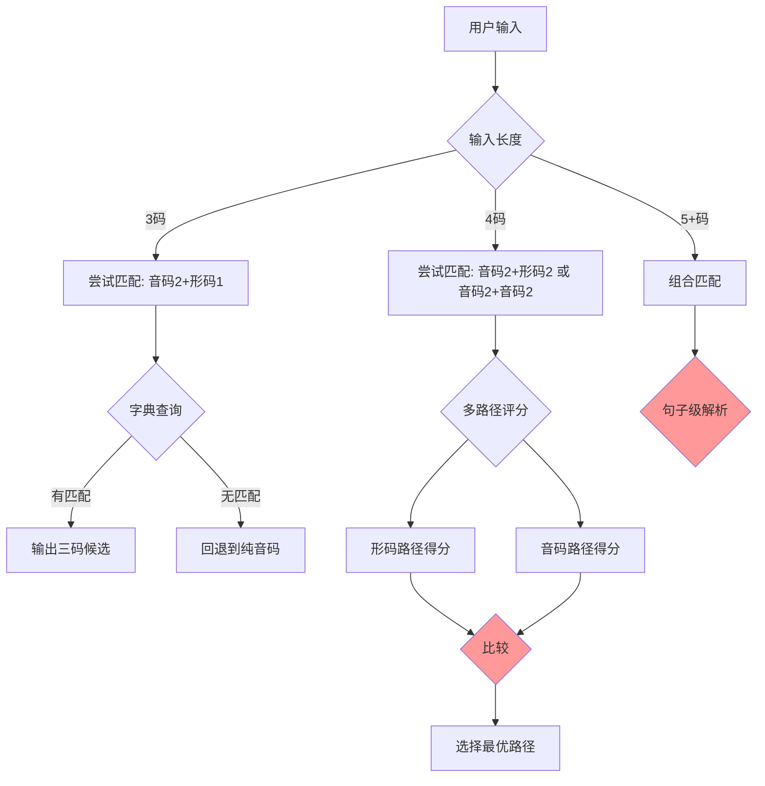
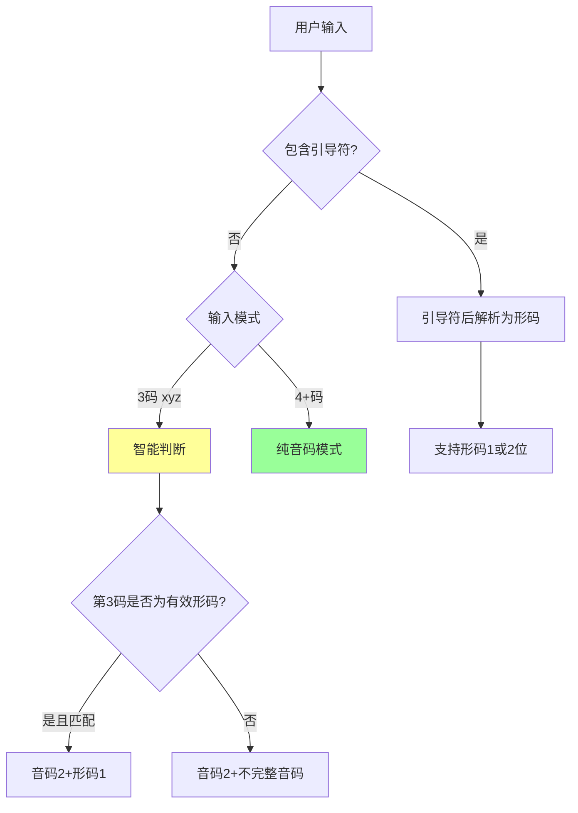
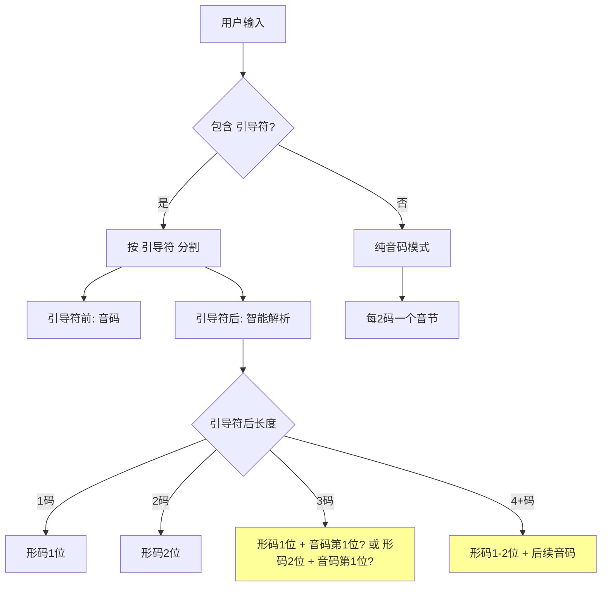

# 18键双拼形码输入方案对比分析 (v2)

**版本**: v1.0
**日期**: 2026-01-08
**约束条件**:
- 音码固定2位（小鹤双拼）
- 形码支持1-2位
- 形码必须服务于最接近的音码
- 需要与18键共键模糊输入兼容

---

## 手机输入体验分析

### 候选选择成本

| 候选数量 | 用户操作 | 体验评级 |
|----------|----------|----------|
| 1-3个 | 直接点击第一排 | ⭐⭐⭐⭐⭐ 极佳 |
| 4-9个 | 点击候选栏 | ⭐⭐⭐⭐ 良好 |
| 10-20个 | 需要滑动/翻页 | ⭐⭐⭐ 可接受 |
| 20+个 | 多次翻页寻找 | ⭐⭐ 体验差 |
| 50+个 | 寻找困难 | ⭐ 体验极差 |

### 形码的价值

形码的核心价值是**减少候选数量**：

| 输入方式 | 典型候选数 | 体验 |
|----------|------------|------|
| 纯音码 `sy` | 20-50个 | 需翻页 |
| 音码+1位形码 `syf` | 5-15个 | 可能翻页 |
| 音码+2位形码 `syff` | 1-5个 | 通常直选 |

**结论**：形码越精确，候选越少，选字越快。2位形码在复杂场景下很有价值。

---

## 问题核心

在无引导符的情况下，用户输入序列存在歧义：

| 用户输入 | 可能解析1 | 可能解析2 |
|----------|-----------|-----------|
| `syf` | 音码`sy` + 形码`f` (损) | 音码`sy` + 不完整音码`f` |
| `syff` | 音码`sy` + 形码`ff` (损) | 音码`sy` + 音码`ff` (顺风) |
| `syffu` | 音码`sy` + 形码`ff` + 不完整`u` | 音码`sy` + 音码`ff` + 不完整`u` |
| `syffui` | 音码`sy` + 形码`ff` + 音码`ui` | 音码`sy` + 音码`ff` + 音码`ui` |

**核心矛盾**：形码1-2位的可变长度与双拼2位定长产生歧义。

---

## 方案对比分析

### 方案1：全智能识别三码/四码

**设计思路**：通过字典匹配和统计模型，智能判断用户意图。



**18键特殊挑战**：
```
用户输入: syfg
↓ 共键模糊展开
可能的原始输入:
- syfg, syff, sygg, syfg (f/g共键)
- dyfg, dyfg, ... (s/d共键)
- sygg, syff, ... 

每个展开都需要多路径解析！
指数级复杂度: 8共键对 × 4位输入 = 巨大搜索空间
```

| 优点 | 缺点 |
|------|------|
| 用户体验最流畅 | 实现复杂度极高 |
| 无需额外按键 | 需要高质量概率模型 |
| 理想状态下最高效 | 18键模糊放大歧义 |
| | 无法保证100%准确 |
| | 性能开销大 |

**可行性评估**: ⭐⭐ (非常困难，尤其结合18键)

---

### 方案2：智能识别三码，四码需引导符

**设计思路**：妥协方案 - 三码较易识别，四码歧义太大需引导。



**解析规则**：
- `syf` → 智能判断（若 `sy[f` 有匹配则解析为形码）
- `syff` → 默认解析为 `sy` + `ff`（两个音码），除非输入 `sy[ff`
- `sy[f` → 明确：音码 `sy` + 形码 `f`
- `sy[ff` → 明确：音码 `sy` + 形码 `ff`

| 优点 | 缺点 |
|------|------|
| 三码输入无需引导符 | 用户需记住规则 |
| 四码明确无歧义 | 三码智能仍可能出错 |
| 平衡效率和准确性 | 两套规则增加心智负担 |
| 实现复杂度适中 | |

**18键兼容性分析**：
```
三码 syf 在18键下的模糊：
- syf, syg (f/g共键)
- dyf, dyg (s/d共键)
- ...

需要检查所有模糊展开是否有有效形码匹配
复杂度可控，因为只检查三码
```

**可行性评估**: ⭐⭐⭐ (中等难度)

---

### 方案3：强制引导符，智能识别三码或四码（当前目标）

**设计思路**：引导符明确分隔，形码长度智能识别。



**解析规则**：
- `sy` → 音码 `sy`
- `sy[f` → 音码 `sy` + 形码 `f`
- `sy[ff` → 音码 `sy` + 形码 `ff`
- `sy[fui` → 音码 `sy` + 形码 `f` + 音码 `ui` (因为形码后满2位)
- `sy[ffui` → 音码 `sy` + 形码 `ff` + 音码 `ui`

**关键问题**：`sy[ffu` 如何解析？
- A) `sy` + `ff` + 不完整 `u`
- B) `sy` + `f` + `fu`（完整音码）

**建议规则**：贪婪匹配形码后，按2位分割音码
- `sy[ffu` → `sy` + `ff` + 待输入 `u`

| 优点 | 缺点 |
|------|------|
| 引导符明确分隔 | 需要输入引导符 |
| 形码范围确定 | 引导符后仍有3/4码歧义 |
| 当前方案已实现基础 | |
| 18键模糊可精确应用 | |

**可行性评估**: ⭐⭐⭐⭐ (较易实现)

---

### 方案4：其他可行方案

#### 4.1 固定形码长度方案

**思路**：形码固定为1位或2位，消除歧义。

**子方案4.1a：形码固定1位**
```
sy   → 音码 sy
syf  → 音码 sy + 形码 f
syfu → 音码 sy + 形码 f + 待输入 u
syfui → 音码 sy + 形码 f + 音码 ui
```

| 优点 | 缺点 |
|------|------|
| 完全无歧义 | 形码区分度降低 |
| 无需引导符 | 无法使用2位形码精确筛选 |
| 规则简单 | |

**子方案4.1b：形码固定2位**
```
sy     → 音码 sy
syff   → 音码 sy + 形码 ff
syffui → 音码 sy + 形码 ff + 音码 ui
```

| 优点 | 缺点 |
|------|------|
| 完全无歧义 | 无法使用1位形码快速筛选 |
| 无需引导符 | 每个形码必须2位 |
| 形码区分度高 | |

---

#### 4.2 尾码标记方案

**思路**：用特殊按键标记输入结束/确认形码。

```
sy → 音码 sy（可能有更多输入）
syf + 空格 → 音码 sy + 形码 f（确认）
syff + 空格 → 音码 sy + 形码 ff（确认）
```

| 优点 | 缺点 |
|------|------|
| 用户主动确认 | 每个字都需要额外按键 |
| 灵活支持1-2位 | 效率降低 |
| | 与上屏操作冲突 |

---

#### 4.3 延迟判断 + 候选动态更新

**思路**：实时显示所有可能解析的候选，用户输入更多后自动收敛。

```
用户输入: s
候选: [所有s开头的字]

用户输入: sy
候选: [sy拼音的字: 损, 孙, 笋...]

用户输入: syf
候选: 
  - [sy+f形码: 损(ff匹配f)]  ← 形码解析
  - [syf不完整，等待...]      ← 音码解析

用户输入: syff
候选:
  - [sy+ff形码: 损(ff)]      ← 形码解析
  - [sy+ff音码: 顺风...]     ← 音码解析（双字词）

用户选择或继续输入...
```

| 优点 | 缺点 |
|------|------|
| 展示所有可能性 | 候选过多，干扰用户 |
| 用户可直接选择 | 实现复杂 |
| 无需引导符 | 候选排序是难点 |

---

#### 4.4 分区候选方案

**思路**：候选列表分区显示不同解析结果。

```
用户输入: syff

候选区1 [形码解析]: 
  1. 损 (sy+ff)
  
候选区2 [音码解析]:
  2. 顺风 (sy+ff)
  3. 随风 (sy+ff 模糊)
  ...
```

| 优点 | 缺点 |
|------|------|
| 用户可选择解析方式 | UI需要分区支持 |
| 灵活性高 | Trime可能不支持 |
| | 候选数量翻倍 |

---

## 五级方案阶梯分析（由简到难）

根据用户需求，重新整理为五个层级，结合手机输入特性分析。

### Level 1：纯音码

**设计**：完全不支持形码，仅使用双拼音码。

```
sy → 音码sy → 候选: 损/孙/笋/...（20-50个）
syui → 音码sy + 音码ui → 候选: 损失/顺遂/...
```

| 指标 | 评价 |
|------|------|
| 实现难度 | ⭐⭐⭐⭐⭐ 最简单 |
| 用户学习成本 | ⭐⭐⭐⭐⭐ 零 |
| 输入效率 | ⭐⭐ 候选多需翻页 |
| 18键兼容 | ⭐⭐⭐⭐⭐ 完美 |

**手机体验**：候选20-50个，需要多次翻页，体验较差。适用于高频词和词组输入。

---

### Level 2：可选1位形码，无引导符

**设计**：形码固定1位，无需引导符，用户可选择是否输入。

```
sy    → 纯音码 → 候选: 损/孙/笋/...（20-50个）
syf   → 音码sy + 形码f → 候选: 损/孙（5-15个，形码过滤）
syfui → 音码sy + 形码f + 音码ui → 候选: 损失
syfuig → sy + f + ui + g → 损失（双字带形码）
```

**解析规则**：
- 每2位为音码基础
- 紧跟的第3位（如有）为可选形码
- 循环：音码2 + 形码0或1

| 指标 | 评价 |
|------|------|
| 实现难度 | ⭐⭐⭐⭐ 简单 |
| 用户学习成本 | ⭐⭐⭐⭐ 低 |
| 输入效率 | ⭐⭐⭐⭐ 良好 |
| 18键兼容 | ⭐⭐⭐⭐⭐ 完美 |
| 形码精确度 | ⭐⭐⭐ 1位形码区分度有限 |

**手机体验**：候选5-15个，大部分场景可直接选择，少数需翻页。

---

### Level 3：可选1位形码 + 引导符贪心形码匹配（推荐目标）⭐

**设计**：
- 无引导符时：固定1位形码（Level 2规则）
- 有引导符时：**贪心匹配形码**，尽可能多地匹配形码字符

```
无引导符模式：
  sy     → 纯音码（20-50个候选）
  syf    → 音码sy + 形码f（无引导，5-15个候选）
  syfui  → 音码sy + 形码f + 音码ui

有引导符模式（贪心形码）：
  sy[f   → 音码sy + 形码f（等待更多形码输入）
  sy[ff  → 音码sy + 形码ff（2位形码）
  sy[ffu → 音码sy + 形码ff + 待输入u（贪心后，u是新音码）
  sy[ffui → 音码sy + 形码ff + 音码ui
```

**核心思想**：
> 用户主动使用 `[` 时，输入连贯性已被打破（为了找冷门字）。
> 此时继续"打破"也没关系，所以引导符后贪心匹配形码。

**解析规则**：
1. **无 `[` 时**：按 Level 2 规则（2+1 循环，形码固定1位）
2. **有 `[` 时**：引导符后**贪心匹配形码**
   - 形码最多2位
   - 优先尝试2位形码匹配
   - 2位形码满后，后续自动作为新音码

**引导符后的贪心解析**：
```
sy[    → 等待形码输入
sy[f   → 形码f（等待，可能还有第2位）
sy[ff  → 形码ff（2位满，后续是新音码）
sy[fu  → 形码fu（如果fu是有效形码）或 形码f + 新音码u开始
sy[ffu → 形码ff + 新音码u开始（贪心2位后，u是新音码）
sy[ffui → 形码ff + 音码ui
```

**贪心策略细节**：
- `[` 后第1位：一定是形码
- `[` 后第2位：检查与第1位组合是否为有效2位形码
  - 如果是：作为2位形码
  - 如果不是：第1位是完整形码，第2位是新音码开始
- `[` 后第3位：一定是新音码的开始

| 指标 | 评价 |
|------|------|
| 实现难度 | ⭐⭐⭐ 中等 |
| 用户学习成本 | ⭐⭐⭐ 中等 |
| 输入效率 | ⭐⭐⭐⭐⭐ 优秀 |
| 18键兼容 | ⭐⭐⭐⭐ 良好 |
| 形码精确度 | ⭐⭐⭐⭐⭐ 支持1-2位 |

**手机体验**：
- 常用场景：`syf` 无引导符，5-15个候选
- 精确场景：`sy[ff` 有引导符，1-5个候选，几乎直选

---

### Level 4：强制引导符 + 智能识别1/2位形码（当前已实现）

**设计**：所有形码都需要 `[` 引导符，引导符后智能识别长度。

```
sy     → 纯音码
sy[f   → 音码sy + 形码f（必须有引导符）
sy[ff  → 音码sy + 形码ff
sy[fui → 音码sy + 形码f + 音码ui
```

**与Level 3的对比**：
- Level 3：`syf` 无需引导符即可输入1位形码
- Level 4：`sy[f` 必须有引导符才能输入形码

| 指标 | 评价 |
|------|------|
| 实现难度 | ⭐⭐⭐⭐ 较简单 |
| 用户学习成本 | ⭐⭐⭐ 中等 |
| 输入效率 | ⭐⭐⭐ 每次形码都需额外按键 |
| 18键兼容 | ⭐⭐⭐⭐⭐ 完美 |
| 形码精确度 | ⭐⭐⭐⭐⭐ 支持1-2位 |

**手机体验**：形码输入需要额外按引导符，增加1次按键。

---

### Level 5：纯智能识别（终极目标，暂不推荐）

**设计**：无需任何引导符，系统智能识别所有情况。

```
syf    → 智能判断：音码sy + 形码f
syff   → 智能判断：音码sy + 形码ff 还是 音码sy + 音码ff
syffui → 智能判断多种可能组合
```

| 指标 | 评价 |
|------|------|
| 实现难度 | ⭐ 极难 |
| 用户学习成本 | ⭐⭐⭐⭐⭐ 零 |
| 输入效率 | ⭐⭐⭐⭐⭐ 理想状态下最高 |
| 18键兼容 | ⭐ 模糊匹配放大歧义 |
| 准确性 | ⭐⭐ 无法保证 |

**手机体验**：理想情况下最好，但18键共键模糊会导致歧义爆炸，不推荐。

---

## 五级方案对比总结

```
用户输入体验 ←────────────────────────→ 实现复杂度
    最流畅                                    最困难
       │                                        │
   Level 5 ─── Level 3 ─── Level 2 ─── Level 4 ─── Level 1
   全智能      混合模式     固定1位    强制引导     纯音码
```

| Level | 形码支持 | 需引导符 | 18键友好 | 手机体验 | 推荐度 |
|-------|----------|----------|----------|----------|--------|
| 1 | 无 | - | ⭐⭐⭐⭐⭐ | ⭐⭐ | ⭐⭐ |
| 2 | 1位 | 否 | ⭐⭐⭐⭐⭐ | ⭐⭐⭐⭐ | ⭐⭐⭐⭐ |
| **3** | **1-2位** | **可选** | **⭐⭐⭐⭐** | **⭐⭐⭐⭐⭐** | **⭐⭐⭐⭐⭐** |
| 4 | 1-2位 | 强制 | ⭐⭐⭐⭐⭐ | ⭐⭐⭐ | ⭐⭐⭐ |
| 5 | 任意 | 否 | ⭐ | ⭐⭐⭐⭐⭐ 理论 | ⭐ |

---

## 推荐实施路径

### 阶段一：先实现 Level 2（固定1位形码）

**目标**：快速可用的基础版本

**规则**：
- 纯音码：每2位一个音节
- 带形码：2位音码 + 1位形码（可选）
- 无需引导符

**验证**：测试1位形码在实际使用中的区分度是否足够

### 阶段二：升级到 Level 3（混合模式）

**目标**：在Level 2基础上增加2位形码支持

**增量改动**：
- 添加 `[` 引导符识别
- 引导符后智能判断形码长度
- 向后兼容Level 2的所有输入

**智能识别策略（引导符后）**：
```lua
function parse_after_bracket(remaining)
  if #remaining == 0 then return nil end  -- 等待
  if #remaining == 1 then
    return {shape = remaining, uncertain = true}  -- 等待更多输入
  end
  if #remaining == 2 then
    if is_valid_2char_shape(remaining) then
      return {shape = remaining}  -- 2位形码
    else
      return {shape = remaining:sub(1,1), pinyin_start = remaining:sub(2,2)}
    end
  end
  -- 3+位：尝试2位形码
  local two_char = remaining:sub(1,2)
  if is_valid_2char_shape(two_char) then
    return {shape = two_char, pinyin_start = remaining:sub(3)}
  else
    return {shape = remaining:sub(1,1), pinyin_start = remaining:sub(2)}
  end
end
```

---

## 综合对比表（原方案编号）

| 方案 | 输入效率 | 准确性 | 实现难度 | 18键兼容 | 推荐度 |
|------|----------|--------|----------|----------|--------|
| 1. 全智能 | ⭐⭐⭐⭐⭐ | ⭐⭐⭐ | ⭐ | ⭐ | ⭐⭐ |
| 2. 三码智能+四码引导 | ⭐⭐⭐⭐ | ⭐⭐⭐⭐ | ⭐⭐⭐ | ⭐⭐⭐ | ⭐⭐⭐ |
| 3. 强制引导+智能长度 | ⭐⭐⭐ | ⭐⭐⭐⭐⭐ | ⭐⭐⭐⭐ | ⭐⭐⭐⭐ | ⭐⭐⭐⭐ |
| 4.1a 固定1位形码 | ⭐⭐⭐⭐ | ⭐⭐⭐⭐⭐ | ⭐⭐⭐⭐⭐ | ⭐⭐⭐⭐⭐ | ⭐⭐⭐⭐ |
| 4.1b 固定2位形码 | ⭐⭐⭐ | ⭐⭐⭐⭐⭐ | ⭐⭐⭐⭐⭐ | ⭐⭐⭐⭐⭐ | ⭐⭐⭐ |
| 4.3 延迟判断 | ⭐⭐⭐ | ⭐⭐⭐⭐ | ⭐⭐⭐ | ⭐⭐⭐ | ⭐⭐⭐ |

---

## 最终推荐：Level 3（可选1位形码 + 引导符2位形码）⭐

**根据用户倾向，这是最平衡的选择。**

### 设计总结

```
常用输入（无引导符）：
  sy    → 纯音码（20-50候选）
  syf   → 音码 + 1位形码（5-15候选）
  syfui → 音码 + 1位形码 + 音码

精确输入（有引导符）：
  sy[ff   → 音码 + 2位形码（1-5候选）
  sy[ffui → 音码 + 2位形码 + 音码
```

### 核心优势

1. **常用场景高效**：1位形码无需引导符
2. **精确场景可用**：2位形码通过引导符支持
3. **18键兼容良好**：音码和形码都支持共键模糊
4. **渐进式学习**：用户可从Level 2入手，逐步使用2位形码

### 实施策略

**阶段一：实现 Level 2 作为基础**
- 固定1位形码，完全无歧义
- 快速验证基础功能
- 规则：每2位音码 + 可选1位形码

**阶段二：增量升级到 Level 3**
- 添加 `[` 引导符支持
- 实现引导符后的智能识别
- 保持向后兼容 Level 2 的所有输入

### 核心技术实现要点

1. **Level 2 解析**（完全无歧义）
   ```
   输入序列按 2+1 循环解析：
   s y f u i g → (sy+f) (ui+g)
   s y u i → (sy) (ui)  -- 末尾2位无形码
   s y f u i → (sy+f) (ui等待)
   ```

2. **Level 3 引导符后解析**（需智能判断）
   ```
   sy[f   → 等待更多输入
   sy[ff  → 确定2位形码 ff
   sy[fu  → f是1位形码，u是新音码开始
   sy[ffu → ff是2位形码，u是新音码开始
   ```

3. **智能判断策略**
   - 检查 `[` 后2字符是否为有效2位形码组合
   - 如果是，作为2位形码
   - 如果不是，第1位是形码，第2位是新音码

---

## 结论

| 用户优先级 | 推荐方案 |
|------------|----------|
| **平衡效率和灵活** | **Level 3（可选1位 + 引导符2位）⭐** |
| 追求简单可靠 | Level 2（固定1位形码） |
| 保守稳妥 | Level 4（强制引导符） |

---

## 下一步行动

确认采用 **Level 3** 方案后，我将：
1. 更新 [`moqi_xh-18key.schema.yaml`](../moqi_xh-18key.schema.yaml) 的 speller 规则
2. 修改 Lua processor 支持无引导符1位形码解析
3. 更新 Lua filter 适配新的解析逻辑
4. 更新 [`plans/moqi-xh-18key-design.md`](../plans/moqi-xh-18key-design.md) 设计文档

**建议先实现 Level 2 验证基础功能，再增量升级到 Level 3。**

