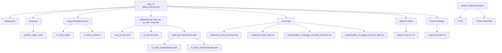

# Android初次部署依赖分析

## 概览

本文档分析了 [`moqi_xh-18key.schema.yaml`](../moqi_xh-18key.schema.yaml) 和 [`shouxin_18key.trime.yaml`](../shouxin_18key.trime.yaml) 的完整依赖树，用于创建初次部署脚本 [`init_deploy_android.bat`](../init_deploy_android.bat)。

## 依赖关系图



---

## 详细依赖清单

### 1. 核心配置文件

#### 1.1 方案配置文件
- [`moqi_xh-18key.schema.yaml`](../moqi_xh-18key.schema.yaml) - 主输入方案
- [`default.yaml`](../default.yaml) - Rime默认配置
- [`default.custom.yaml`](../default.custom.yaml) - 用户自定义配置（如果存在）

#### 1.2 主题与键盘配置
- [`shouxin_18key.trime.yaml`](../shouxin_18key.trime.yaml) - Android 18键键盘主题

### 2. 共享配置模块

#### 2.1 基础配置模块
- [`moqi.yaml`](../moqi.yaml) - 墨奇方案共享配置
  - 引擎配置（processors, segmentors, translators, filters）
  - 反查配置
  - OpenCC配置
  - 标点符号配置
  - 引导前缀配置

#### 2.2 符号配置
- [`symbols_caps_v.yaml`](../symbols_caps_v.yaml) - 符号输入配置

### 3. 词典文件

#### 3.1 主词典
- [`moqi.extended.dict.yaml`](../moqi.extended.dict.yaml) - 墨奇扩展词典（主词库）

#### 3.2 大字集词典
- [`moqi_big.extended.dict.yaml`](../moqi_big.extended.dict.yaml) - 大字集词典（4万字）

#### 3.3 依赖词典（schema dependencies）
- [`easy_en.dict.yaml`](../easy_en.dict.yaml) - 英文单词词典
- [`jp_sela.dict.yaml`](../jp_sela.dict.yaml) - 日语词典
- [`emoji.dict.yaml`](../emoji.dict.yaml) - Emoji词典
- [`cangjie5.dict.yaml`](../cangjie5.dict.yaml) - 仓颉五代（用于反查）
- [`radical_flypy.dict.yaml`](../radical_flypy.dict.yaml) - 部件组字（用于反查）
- [`reverse_moqima.dict.yaml`](../reverse_moqima.dict.yaml) - 墨奇反查

#### 3.4 词库子文件（通过 import_tables 引入）

**墨奇词库** (`cn_dicts_moqi/`)：
- [`cn_dicts_moqi/8105.dict.yaml`](../cn_dicts_moqi/8105.dict.yaml) - 8105字表
- [`cn_dicts_moqi/41448.dict.yaml`](../cn_dicts_moqi/41448.dict.yaml) - 4万字大字表
- [`cn_dicts_moqi/base.dict.yaml`](../cn_dicts_moqi/base.dict.yaml) - 基础词库
- [`cn_dicts_moqi/ext.dict.yaml`](../cn_dicts_moqi/ext.dict.yaml) - 扩展词库
- [`cn_dicts_moqi/cell.dict.yaml`](../cn_dicts_moqi/cell.dict.yaml) - 细胞词库
- [`cn_dicts_moqi/others.dict.yaml`](../cn_dicts_moqi/others.dict.yaml) - 其他词库（可选）

**通用词库** (`cn_dicts_common/`)：
- [`cn_dicts_common/user.dict.yaml`](../cn_dicts_common/user.dict.yaml) - 用户自定义词典
- [`cn_dicts_common/changcijian.dict.yaml`](../cn_dicts_common/changcijian.dict.yaml) - 常词多字词
- [`cn_dicts_common/changcijian3.dict.yaml`](../cn_dicts_common/changcijian3.dict.yaml) - 常词3字词

### 4. Lua脚本

#### 4.1 核心Lua脚本（18键专用）
- [`lua/precise_input_processor.lua`](../lua/precise_input_processor.lua) - 精确输入处理器
- [`lua/precise_input_filter.lua`](../lua/precise_input_filter.lua) - 精确输入过滤器
- [`lua/sharedkey_shuangpin_auxcode_processor.lua`](../lua/sharedkey_shuangpin_auxcode_processor.lua) - 共键双拼辅助码处理器
- [`lua/sharedkey_shuangpin_auxcode_filter.lua`](../lua/sharedkey_shuangpin_auxcode_filter.lua) - 共键双拼辅助码过滤器

#### 4.2 通用Lua翻译器
- [`lua/date_translator.lua`](../lua/date_translator.lua) - 日期时间翻译器
- [`lua/lunar.lua`](../lua/lunar.lua) - 农历翻译器
- [`lua/unicode.lua`](../lua/unicode.lua) - Unicode翻译器
- [`lua/number_translator.lua`](../lua/number_translator.lua) - 数字金额翻译器
- [`lua/calculator.lua`](../lua/calculator.lua) - 计算器

#### 4.3 通用Lua过滤器
- [`lua/pro_comment_format.lua`](../lua/pro_comment_format.lua) - 注释格式化
- [`lua/is_in_user_dict.lua`](../lua/is_in_user_dict.lua) - 用户词典标记

#### 4.4 Lua依赖库
- [`lua/sbxlm/lib.lua`](../lua/sbxlm/lib.lua) - sbxlm库（精确输入依赖）

### 5. OpenCC配置文件

#### 5.1 简繁转换
- `opencc/s2t.json` - 系统自带（简转繁）

#### 5.2 墨奇拆分
- [`opencc/moqi_chaifen.json`](../opencc/moqi_chaifen.json)
- [`opencc/moqi_chaifen.txt`](../opencc/moqi_chaifen.txt)
- [`opencc/moqi_chaifen_all.json`](../opencc/moqi_chaifen_all.json)
- [`opencc/moqi_chaifen_all.txt`](../opencc/moqi_chaifen_all.txt)

#### 5.3 其他转换
- [`opencc/chinese_english.json`](../opencc/chinese_english.json)
- [`opencc/chinese_english.txt`](../opencc/chinese_english.txt)
- [`opencc/emoji.json`](../opencc/emoji.json)
- [`opencc/emoji.txt`](../opencc/emoji.txt)
- [`opencc/martian.json`](../opencc/martian.json) - 火星文
- [`opencc/martian.txt`](../opencc/martian.txt)

### 6. 自定义短语

**Custom Phrase配置** (`custom_phrase/`)：
- [`custom_phrase/custom_phrase.txt`](../custom_phrase/custom_phrase.txt) - 1、2码置顶
- [`custom_phrase/custom_phrase_3_code.txt`](../custom_phrase/custom_phrase_3_code.txt) - 3码出简让全
- [`custom_phrase/custom_phrase_kf.txt`](../custom_phrase/custom_phrase_kf.txt) - 快符
- [`custom_phrase/custom_phrase_mqzg.txt`](../custom_phrase/custom_phrase_mqzg.txt) - 字根
- [`custom_phrase/custom_phrase_super_1jian.txt`](../custom_phrase/custom_phrase_super_1jian.txt) - 超强tab 1码
- [`custom_phrase/custom_phrase_super_2jian.txt`](../custom_phrase/custom_phrase_super_2jian.txt) - 超强tab 2码
- [`custom_phrase/custom_phrase_super_3jian.txt`](../custom_phrase/custom_phrase_super_3jian.txt) - 超强tab 3码
- [`custom_phrase/custom_phrase_super_3jian_no_conflict.txt`](../custom_phrase/custom_phrase_super_3jian_no_conflict.txt) - 无冲突3简
- [`custom_phrase/custom_phrase_super_4jian_no_conflict.txt`](../custom_phrase/custom_phrase_super_4jian_no_conflict.txt) - 无冲突4简

### 7. 字体文件（Trime专用）

根据 [`shouxin_18key.trime.yaml`](../shouxin_18key.trime.yaml) 配置：
- `han.ttf` - 候选字体
- `comment.ttf` - 注释字体
- `hanb.ttf` - 汉字粗体
- `latin.ttf` - 拉丁字母字体
- `label.ttf` - 标签字体
- `symbol.ttf` - 符号字体
- `iconfont.ttf` - 图标字体（工具栏）

**注意**：字体文件通常不在配置仓库中，需要单独提供或从Trime安装包中获取。

---

## 部署顺序建议

根据依赖关系，建议按以下顺序部署文件：

### 阶段1：基础配置
1. 核心配置文件（`default.yaml`, `default.custom.yaml`）
2. 共享配置模块（`moqi.yaml`, `symbols_caps_v.yaml`）
3. 主题配置（`shouxin_18key.trime.yaml`）

### 阶段2：词典文件
1. 词库子文件（`cn_dicts_moqi/`, `cn_dicts_common/`）
2. 主词典文件（`moqi.extended.dict.yaml`, `moqi_big.extended.dict.yaml`）
3. 依赖词典（`easy_en.dict.yaml`, `jp_sela.dict.yaml`, 等）

### 阶段3：输入方案
1. 主输入方案（`moqi_xh-18key.schema.yaml`）

### 阶段4：扩展功能
1. Lua脚本及依赖库
2. OpenCC配置文件
3. 自定义短语

### 阶段5：资源文件（可选）
1. 字体文件

---

## 部署目标目录

Android Trime 的配置目录结构：
```
/sdcard/rime2/
├── *.yaml                      # 配置文件和方案文件
├── *.dict.yaml                 # 词典文件
├── cn_dicts_moqi/              # 墨奇词库
├── cn_dicts_common/            # 通用词库
├── custom_phrase/              # 自定义短语
├── lua/                        # Lua脚本
│   ├── *.lua                   # 各种Lua脚本
│   └── sbxlm/                  # Lua依赖库
│       └── lib.lua
├── opencc/                     # OpenCC配置
│   ├── *.json                  # OpenCC配置文件
│   └── *.txt                   # OpenCC数据文件
└── build/                      # 编译生成目录（自动生成）
```

---

## 注意事项

### 1. 可选依赖
以下文件为可选依赖，可根据需要部署：
- `cn_dicts_moqi/others.dict.yaml` - 其他词库
- 反查相关词典（如果不使用反查功能）
- 字体文件（使用系统默认字体）

### 2. 性能考虑
- 大字集词典（`moqi_big.extended.dict.yaml`）会增加部署时间
- 可根据实际需求选择是否启用4万字大字表

### 3. 用户数据
- 用户词典数据库文件（`.userdb/`）不需要部署，会自动生成

### 4. Lua脚本依赖
- `precise_input_processor.lua` 和 `precise_input_filter.lua` 依赖 `sbxlm/lib.lua`
- 必须同时部署才能正常工作

### 5. Trime特有配置
- [`shouxin_18key.trime.yaml`](../shouxin_18key.trime.yaml) 仅用于Android Trime
- Windows/Mac/Linux版本使用不同的主题配置文件
